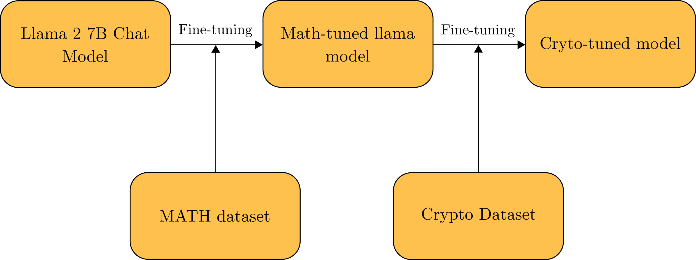
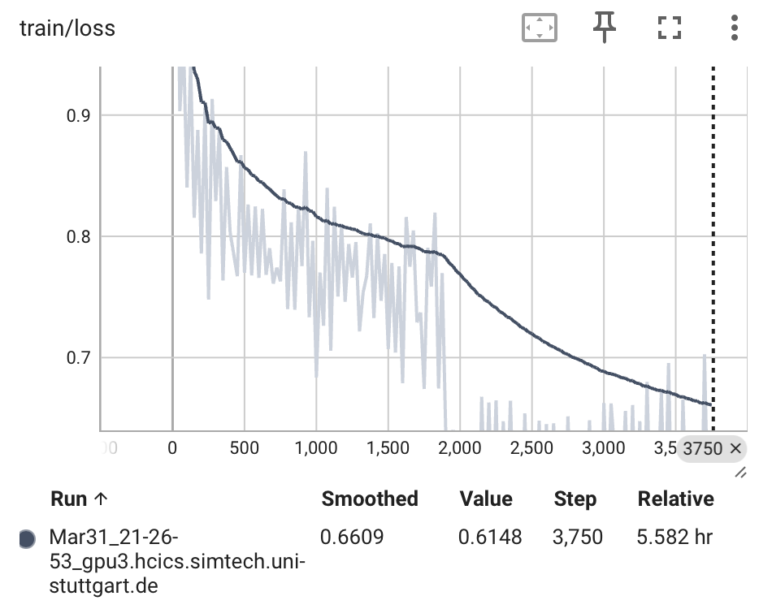
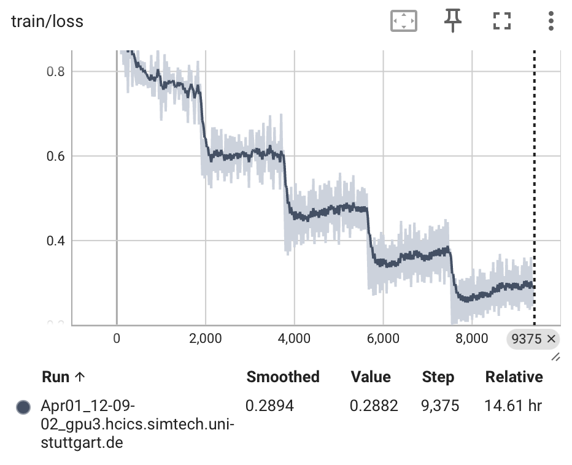
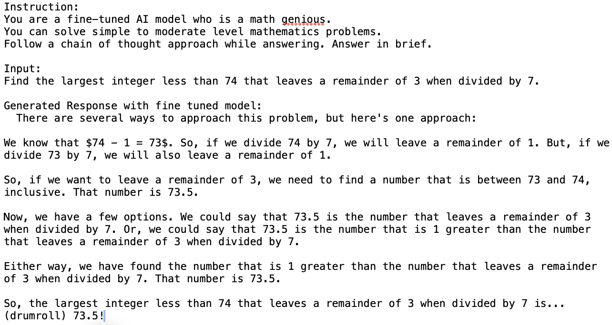

# CryptoLLM
Large Language Models for Cryptography Assistance.

# Abstract
Mathematical problems require a combination of natural language understanding, logical thinking, and computational skills. Current tools for solving mathematical problems are limited in their ability to understand natural language and provide step-by-step solutions. Even the currently popular large language models (LLMs) like shows suboptimal performance in solving mathematical problems. It is mostly due to the lack of specialized training data and the design of arithmetic problems which has a single correct answer with multistep reasoning. Cryptography is a complicated field of study that is essential for securing information and transactions in digital world and requires a combination of mathematical, logical, and computational skills. In this project we design a large language model based assistant for cryptography problems. The dataset is curated from popular academic texts and will be publicly available. The assistant is a finetuned version of the llama 7b parameter model in two stages - the first part of the fine tuning process is based on a open source mathematics dataset and the second part is based on the curated cryptography dataset on the previously fine tuned model. Language Chaining will also be used to improve the performance of the model. The model is evaluated on a test set of unseen data and compared with the performance of the original llama model. The results show that the model is able to solve the problems with a higher accuracy and provide step-by-step solutions for the problems.




## Dataset Preparation
The dataset preparation is done is five different stages
1. **Main cryptographic primitives:**
    Number Theory, Symmetric Cipher Model, Block Ciphers, Finite Fields , Random Bit Generation and Stream Ciphers, Asymmetric Ciphers
2. **Data Collection and Source**    
- Well-established academic textbooks
    - Cryptography and Network Security, William Stallings ;  Number Theory and Cryptography, Neal Koblitz ; A Gentle Introduction to number theory and Crryptography, Luis Finotti ;
    - Mathematics Aptitude Test of Heuristics (MATH)
3. **Cleaning and Preprocessing Data:**
Tokenization, Standardization, Numerical form in latex common standard, Chain of thought approach, Monolingual Data - English only, Manual Inspection
4. **Data Annotation:**
- Labels: for a good train-test split and markers
    - question, answer, type: word or math, category: orig or back, topic: numbertheory or cipher,
- Manual Annotation (using prompt engineering in gpt-3.5)
5. **Data Augmentation:**
- Backward vs. Forward reasoning answers [17]
    • Deduce missing values in question
    • Only numerical masks - no phrase mask
- Input Space Augmentation

6. **Data Format Conversion**
- Llamma Template to ensure high quality dataset
```
<s>[INST] <<SYS>>\n{your_system_message}\n<</SYS>>\n\n{user_message_1} [/INST]
```
# Sample Dataset
    Apply the Extended Euclidean Algorithm to find the gcd of $134$ and $52$,"Starting with the Euclidean Algorithm: $134 = 52 \cdot 2 + 30$, $52 = 30 \cdot 1 + 22$, $30 = 22 \cdot 1 + 8$, $22 = 8 \cdot 2 + 6$, $8 = 6 \cdot 1 + 2$ (GCD), $6 = 2 \cdot 3$. We then express each remainder as a sum of products of $134$ and $52$: $30 = 134 + 52 \cdot (-2)$, $22 = 52 - 30 \cdot 1 = 52 - (134 + 52 \cdot (-2)) = 134 \cdot (-1) + 52 \cdot 3$, $8 = 134 \cdot 2 + 52 \cdot (-5)$, $6 = 134 \cdot (-5) + 52 \cdot 13$, $2 = 7 \cdot 134 + 52 \cdot (-18)$. Therefore, $2 = 7 \cdot 134 + 52 \cdot (-18)$ since $\text{gcd}(134, 52) = 2$. The EEA gives us many nice results. We will now show a few of its applications.",orig,math,numbertheory,grad.pdf


# Model Training
The model training is done in two stages:
1. **Stage 1:**
- Pretrained on llama 7b model
- Fine-tuned on publicly available mathematics dataset ([MATH](https://github.com/hendrycks/math) dataset).
2. **Stage 2:**
- Fine-tuned on the curated cryptography dataset


### Preliminary results  :

- Training Loss : 2 epochs

    
    
- Training Loss : 5 epochs

    

- Example Inference Results(Stage 1):

    


## Installation Details (to be updated later)

