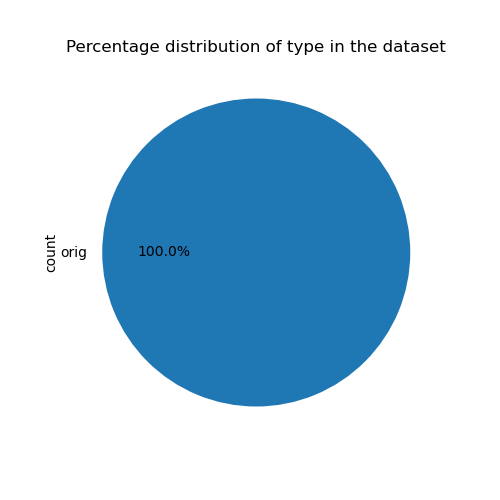
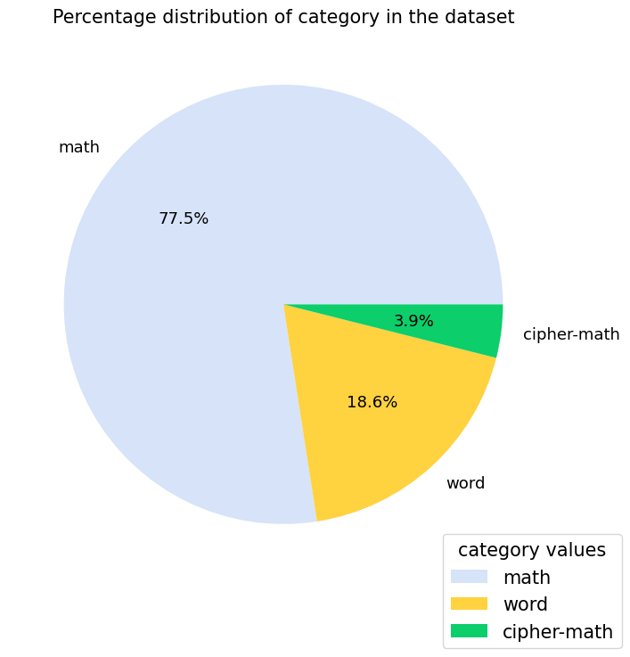
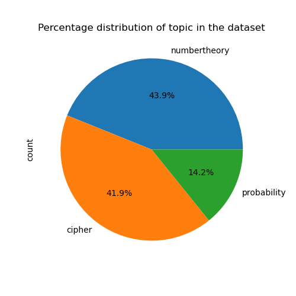
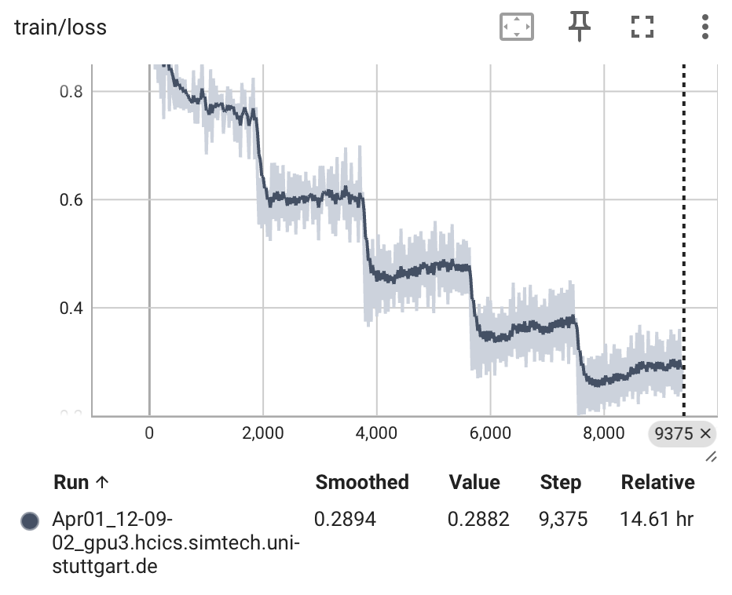
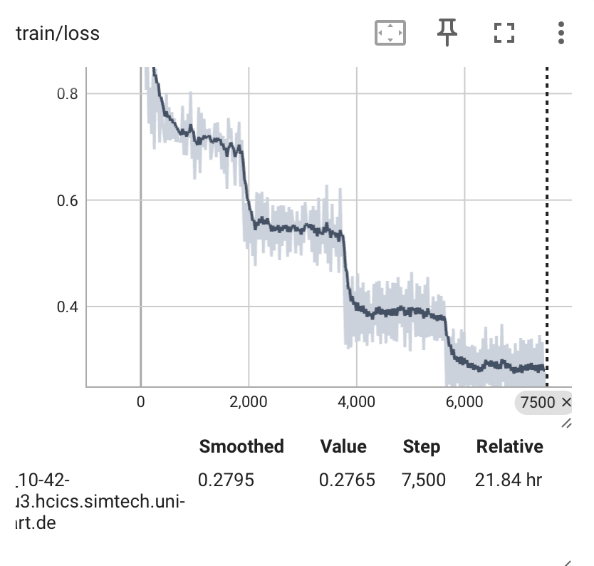
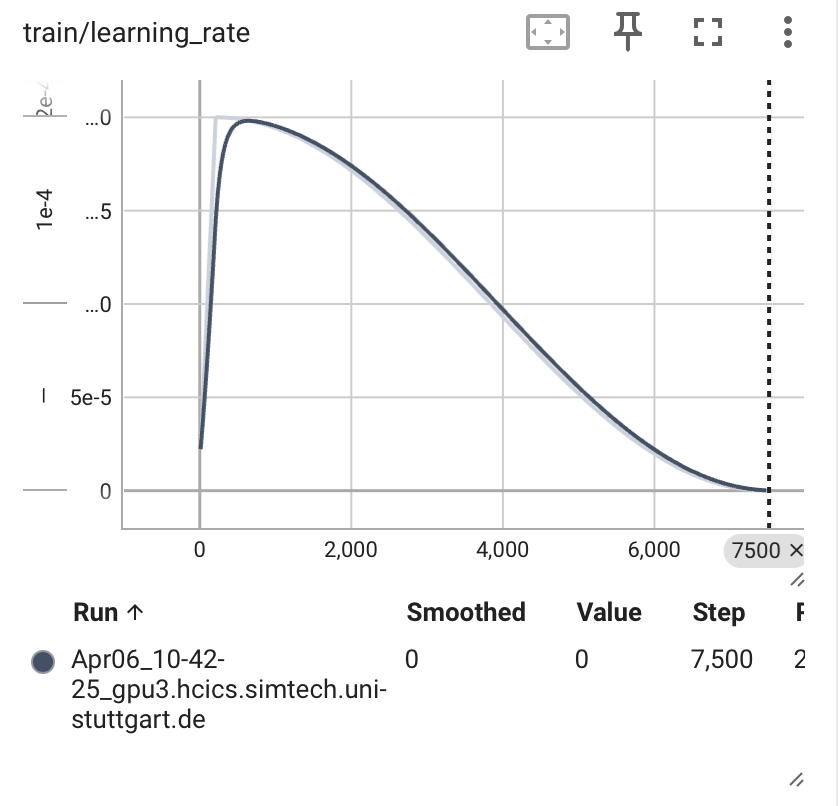
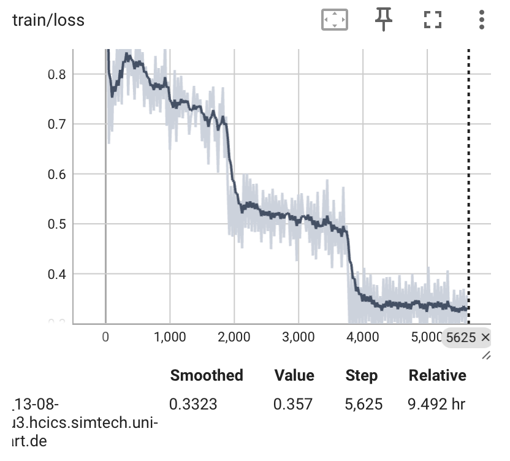

# CryptoLLM - Large Language Models for Cryptography Assistance 🛡️🔐🔑

This repository contains the codebase and results as a part of a Research Project undergone at the University of Stuttgart.

**Author** : Manpa Barman

**Supervisor** :  Mayar Alfares


## Abstract 📝
Real life mathematical problems require a combination of natural language understanding, logical thinking, and computational skills. Cryptography is one such complicated field of computer science that requires a good blend of natural understanding and mathematical reasoning skills. Current tools for solving such problems are limited in their ability by either understanding and interpreting only natural language or only excelling in mathematical computations if inputted in a specific format.
Large Language Models (LLMs) have shown great promise in solving a wide range of problems by understanding and generating human-like text. However, the currently popular large language models (LLMs) like shows suboptimal performance in solving mathematical problems. It is mostly due to the lack of specialized training data and the design of arithmetic problems which has a single correct answer with multistep reasoning. In this project we design a large language model based assistant for cryptography problems. Two versions of CrytoLLM finetuned models are trained for solving the cryptographic problems. The first model is fine-tuned on a already math-finetuned mistral model using the cryptographic dataset and the other version is fine-tuned in two stages - first on the math dataset and then on the cryptographic dataset. The accuracy of both the experiments are compared and the results are discussed. Cryptographic capability evaluation is also an issue arising from the lack of high-quality cryptography datasets. Thus we propose a new cryptodataset, CryptoLLMQA which is curated from popular academic textbooks and resources and will be publicly available for research purposes. No cryptographic benchmark dataset is available currently for extensive evaluation purpose.

This is preliminary work and the results current results can further be improved by fine-tuning on a larger dataset. 


## Table of Contents 📚

* [Installation](#installation)
* [Methodology](#methodology)
* [Directory Structure](#roles-and-implementation)
* [Dataset Statistics](attack-mechanisms)
* [Results and Discussion](#results-and-discussion)
* [License](#license)
* [References](#references)

## Installation 🛠️
1. Clone the repository
```bash
git clone https://github.com/ReboreExplore/cryptographic_llm.git
```
2. Install the required packages
```bash
pip install -r requirements.txt
```
3. To use the llama/mistral model, you can request access from hugging face or can download the model manually.

You can request access to use the model with the links below:

[Llama 2 Family](https://huggingface.co/collections/meta-llama/llama-2-family-661da1f90a9d678b6f55773b)
| [Mistral Family](https://huggingface.co/mistralai)

4. Access to a minimum of 18GB of GPU memory to successfully finetune the model and run inference.

5. Make a hugging face account to upload the models and datasets to the hugging face hub.

To authenticate services to hugging face, generate a token from the hugging face website : 
You need a READ token to access datasets and a WRITE token to upload datasets and models.

More information about generating the token can be found [here](https://huggingface.co/docs/hub/en/security-tokens#)

This token can either be stored in your local Hugging face directory (usually in .cache/huggingface/token) or can be passed as an environment variable.
To save the token in the local directory, run the following command:

```bash
huggingface-cli login
```


## Directory Structure 📁

## Dataset Statistics 📊
- Number of samples: 1000
- Dataset Format: CSV
- Hugging Face Link : [Insert Link Here]

The dataset is has a train split only. The dataset is in the format of a csv file with the following columns:
1.  __question__ : The cryptographic problem statement/question
2.  __answer__ : The answer to the problem statement/question
3.  __type__ : If it is a forward or backward reasoning problem : this only applies to the math problems

    
4.  __category__: The type of the answer i.e. if it is a math problem or a word problem

    

5.  __topic__: The topic of the problem statement/question : numbertheory or probability or cipher

    
    
6.  __source__: The source of the problem statement/question : book abbreviation or website


## Dataset Preparation
The dataset preparation is done is five different stages
1. **Main cryptographic primitives:**
    Number Theory, Symmetric Cipher Model, Block Ciphers, Finite Fields , Random Bit Generation and Stream Ciphers, Asymmetric Ciphers
2. **Data Collection and Source**    
- Well-established academic textbooks
    - Cryptography and Network Security, William Stallings ;  Number Theory and Cryptography, Neal Koblitz ; A Gentle Introduction to number theory and Crryptography, Luis Finotti ;
    - Mathematics Aptitude Test of Heuristics (MATH)
3. **Cleaning and Preprocessing Data:**
Tokenization, Standardization, Numerical form in latex common standard, Chain of thought approach, Monolingual Data - English only, Manual Inspection
4. **Data Annotation:**
- Labels: for a good train-test split and markers
    - question, answer, type: word or math, category: orig or back, topic: numbertheory or cipher,
- Manual Annotation (using prompt engineering in gpt-3.5)
5. **Data Augmentation:**
- Backward vs. Forward reasoning answers [17]
    • Deduce missing values in question
    • Only numerical masks - no phrase mask
- Input Space Augmentation

6. **Data Format Conversion**
- Llamma Template to ensure high quality dataset
```
<s>[INST] <<SYS>>\n{your_system_message}\n<</SYS>>\n\n{user_message_1} [/INST]
```
# Sample Dataset
    Apply the Extended Euclidean Algorithm to find the gcd of $134$ and $52$,"Starting with the Euclidean Algorithm: $134 = 52 \cdot 2 + 30$, $52 = 30 \cdot 1 + 22$, $30 = 22 \cdot 1 + 8$, $22 = 8 \cdot 2 + 6$, $8 = 6 \cdot 1 + 2$ (GCD), $6 = 2 \cdot 3$. We then express each remainder as a sum of products of $134$ and $52$: $30 = 134 + 52 \cdot (-2)$, $22 = 52 - 30 \cdot 1 = 52 - (134 + 52 \cdot (-2)) = 134 \cdot (-1) + 52 \cdot 3$, $8 = 134 \cdot 2 + 52 \cdot (-5)$, $6 = 134 \cdot (-5) + 52 \cdot 13$, $2 = 7 \cdot 134 + 52 \cdot (-18)$. Therefore, $2 = 7 \cdot 134 + 52 \cdot (-18)$ since $\text{gcd}(134, 52) = 2$. The EEA gives us many nice results. We will now show a few of its applications.",orig,math,numbertheory,grad.pdf


# Model Training
The model training is done in two stages:
1. **Stage 1:**
- Pretrained llama 7b model
- Fine-tuned on publicly available mathematics dataset ([MATH](https://github.com/hendrycks/math) dataset).
2. **Stage 2:**
- Fine-tuned on the curated cryptography dataset


 (to be updated later)

## Results till now (to be updated later)

1. Model 1 - Fine tuned on llama 2 chat model -[llama-2-7b-chat-math-01-04-12-10]
    - scheduler = constant
    - lr = 2e-4
    - official prompt
    - tokenizer - eos, bos, pad added
    - 

2. Model 2 - Fine tuned on llama 2 13b model [llama-2-13b-chat-math-06-04-10-30]
    - scheduler = cosine
    - lr = 2e-4
    - official prompt
    - tokenizer - eos, bos, pad added
    - 

    - 


3. Fine tuned on mistral 7b model 
    - scheduler = cosine
    - lr = 2e-4
    - official prompt
    - tokenizer - eos, bos, pad added
    - 
