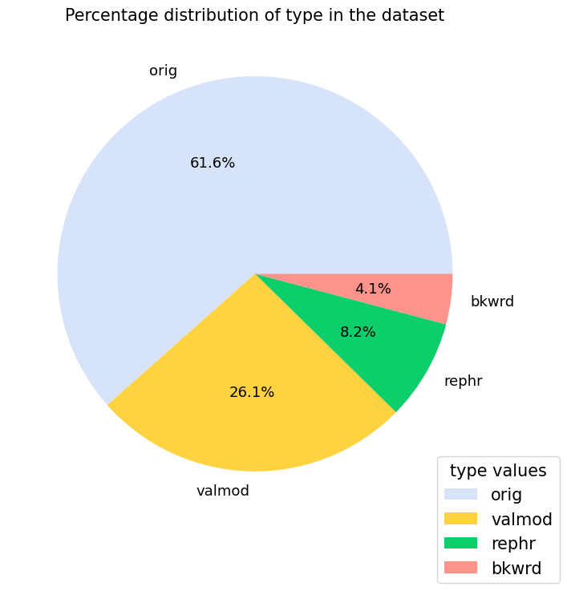
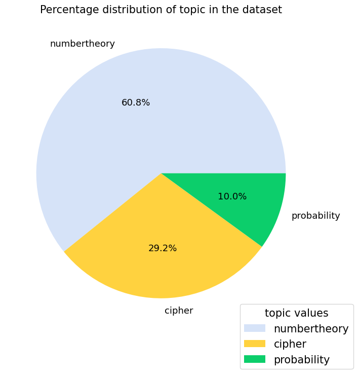

# CryptoLLM - Large Language Models for Cryptography Assistance 🛡️🔐🔑

This repository contains the codebase and results as a part of a Research Project undergone at the University of Stuttgart.

**Author** : Manpa Barman

**Supervisor** :  Mayar Alfares


## Abstract 📝
Real-life mathematical problems require a combination of natural language understanding, logical thinking, and computational skills. Cryptography is one such complicated field of computer science that requires a good blend of natural understanding and mathematical reasoning skills. Current tools for solving such problems are limited in their ability to either understand and interpret only natural language or only excel in mathematical computations if inputted in a specific format.
Large Language Models (LLMs) have shown great promise in solving a wide range of problems by understanding and generating human-like text. However, the currently popular LLMs like GPT-3.5, llama series etc., show suboptimal performance in solving mathematical problems. It is mostly due to the lack of specialized training data and the design of arithmetic problems which has a single correct answer with multistep reasoning. In this project, we design a LLM-based assistant for cryptography problems. We also propose a novel crypto dataset, **CryptoQA** which is curated from popular academic textbooks and resources and is publicly available. Four versions of finetuned models (**CryptoLLMs**) are also trained for solving cryptographic problems. The first two models are fine-tuned on an already math-tuned and a general-purpose LLM respectively using the CryptoQA dataset. The other two versions are fine-tuned in two stages - first on a publicly available math dataset and then on the CryptoQA dataset. A qualitative behavioral analysis of the fine-tuned models is conducted and is made publicly available for experimentation and research. 


## Table of Contents 📚

* [Installation](#installation)
* [Methodology](#methodology)
* [Directory Structure](#roles-and-implementation)
* [Dataset Statistics](attack-mechanisms)
* [Results and Discussion](#results-and-discussion)
* [License](#license)
* [References](#references)

## Installation 🛠️
1. Clone the repository
```bash
git clone https://github.com/ReboreExplore/cryptographic_llm.git
```
2. Install the required packages
```bash
pip install -r requirements.txt
```
3. To use the llama/mistral model, you can request access from hugging face or can download the model manually.

You can request access to use the model with the links below:

[Llama 2 Family](https://huggingface.co/collections/meta-llama/llama-2-family-661da1f90a9d678b6f55773b)
| [Mistral Family](https://huggingface.co/mistralai)

4. Access to a minimum of 18GB of GPU memory to successfully finetune the model and run inference.

5. Make a hugging face account to upload the models and datasets to the hugging face hub.

To authenticate services to hugging face, generate a token from the hugging face website : 
You need a READ token to access datasets and a WRITE token to upload datasets and models.

More information about generating the token can be found [here](https://huggingface.co/docs/hub/en/security-tokens#)

This token can either be stored in your local Hugging face directory (usually in .cache/huggingface/token) or can be passed as an environment variable.
To save the token in the local directory, run the following command:

```bash
huggingface-cli login
```

6. Generate an OpenAI API key to use the GPT-3.5 model for sample generation. The API key can be generated from the OpenAI website. 

You can get your API key from [here](https://beta.openai.com/).


## Directory Structure 📁
```bash
.
├── LICENSE
├── README.md
├── assets
│   ├── dataset_analysis
│   ├── loss-charts-results
│   └── others
├── dataset
│   ├── dataset_files
│   └── dataset_generation
├── inference
│   ├── inference.py
│   ├── playground_notebook_inference
│   └── runs
├── model-preliminary-tests
│   ├── How much does current models know crypto.ipynb
│   ├── language_chaining_tests.ipynb
│   ├── llama_tokenizer
│   └── why_crypto_llama_2.ipynb
├── presentations
│   ├── Manpa_RP_midterm-3.pdf
│   └── research_project_report_manpa-final.pdf
├── requirements.txt
└── train
    ├── data
    └── model
```
## Dataset Statistics 📊
- Number of samples: 510 training samples and 50 testing samples
- Dataset Format: Comman Separated Values (CSV)
- Hugging Face Link : [CryptoQA](https://huggingface.co/datasets/Manpa/cryptoqa-v1)

The dataset is has a train and test split only. The dataset is in the format of a csv file with the following columns:
1.  __question__: The cryptographic problem statement/ question
2.  __answer__: The answer to the problem statement/ question
3.  __type__: This label identifies whether the information within the question or answer pertains primarily to a text problem (`word`), numerical problem (`math`),
or cipher problems containing mathematical computations (`cipher-math`).

    
4.  __category__: This label differentiates between original question-answer pair (`orig`)
and sample generated by augmentation i.e. (`valmod`, `rephr` and `bkwrd`). 

    

5.  __topic__: This label specifies the specific area of cryptography being addressed,
such as `probability`, `numbertheory`, and `cipher`. This topical categorization
allows the LLM to focus on relevant domain knowledge when processing the
information.

    
    
6.  __source__: Initials of the academic texts or sources used. This category does not
pose any additional meaning other than metadata of the dataset creators.


## Dataset Preparation
The dataset preparation is done is five different stages
1. **Main cryptographic primitives:**

    Number Theory, Symmetric Cipher Model, Block Ciphers, Finite Fields , Random Bit Generation and Stream Ciphers, Asymmetric Ciphers
2. **Data Collection and Source**    
- Well-established academic textbooks
    - Cryptography and Network Security, William Stallings ;  Number Theory and Cryptography, Neal Koblitz ; A Gentle Introduction to number theory and Crryptography, Luis Finotti ;
    - Mathematics Aptitude Test of Heuristics (MATH) and MetaMath.
3. **Cleaning and Preprocessing Data:**
Tokenization, Standardization (Numerical form in latex common standard, Chain of thought approach) Monolingual Data
4. **Data Annotation:**
- Labels: for a good train-test split and markers
- Manual Annotation and Rearrangement (using prompt engineering in gpt-3.5)
5. **Data Augmentation:**
- Backward vs. Forward reasoning answers [17]
    • Deduce missing values in question
    • Only numerical masks - no phrase mask
- Input Space Augmentation

6. **Data Format Conversion**
- Llama Template to ensure high quality dataset for llama models
```
<s>[INST] <<SYS>>\n{your_system_message}\n<</SYS>>\n\n{user_message_1} [/INST]
```
# Sample Dataset
   

The dataset generator scripts are availble in the `dataset/dataset_generation` directory.

The dataset is available in the `dataset/dataset_files` directory.

# Models
Four models are fine tuned on the CryptoQA dataset.
1. `crypto-llama7b-math` - [HF Model Card](https://huggingface.co/Manpa/crypto-math-llama7b)
2.  `crypto-llama7b` - [HF Model Card](https://huggingface.co/Manpa/crypto-llama7b)
3.  `crypto-mistral7b-metamath` - [HF Model Card](https://huggingface.co/Manpa/mistral-7b-metamath)
4.  `crypto-metamath` - [HF Model Card](https://huggingface.co/Manpa/crypto-metamath)

To run the models, you can use the scripts in the `train/model/` directory. 

## Loss Charts and Results 📊


## License 📜
The codebase and the dataset are licensed under the MIT License. The dataset is publicly available on the Hugging Face Datasets Hub.